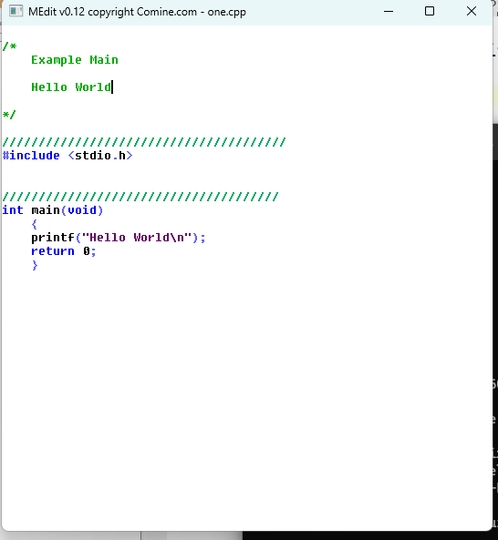

# MEdit
Simple C++ Colorizing Text Ediit for Windows 

- Undo : Ctrl-Z 
- Redo : Ctrl-Y
- Block : Shift and Arrow keys
- Block Copy: Ctrl-C
- Block Paste: Ctrl-V

Usage:  medit <filename> [-lang=C++|C#|C|MSQL|NONE>|-?>

	Defaults to C++ if language is not defined.

Compiled binary is bin folder:  bin/MEdit.exe

